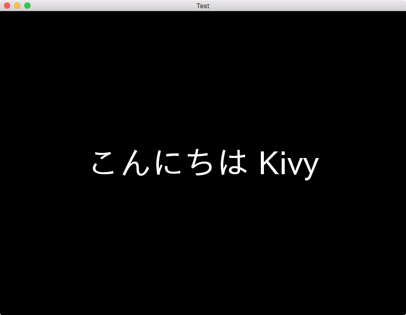

# SampleKivy



## 環境構築

## Kivy

```
pip install kivy
```

## pygame

[Bitbucketのissueに転がっていたコマンド](https://bitbucket.org/pygame/pygame/issues/82/homebrew-on-leopard-fails-to-install#comment-627494)を拝借。

```
brew install sdl sdl_image sdl_mixer sdl_ttf portmidi
pip install hg+http://bitbucket.org/pygame/pygame
```

## Kivyで日本語フォントを表示させる

"[Kivyアプリに日本語を表示させる](http://supportdoc.net/support-kivy/03jp.html)"を参考に、```fonts```ディレクトリ配下にfontを配置。
ディレクトリツリーは次の通り。

```
.
├── fonts
│   ├── ipaexg.ttf
│   └── ipaexm.ttf
└── main.py
```

## References

- [Github: kivy/kivy](https://github.com/kivy/kivy)
- [Github: Setting Up Kivy with various popular IDE's](https://github.com/kivy/kivy/wiki/Setting-Up-Kivy-with-various-popular-IDE's)

### 役に立ったやつ

- [【Python】PyCharm3.4でKivyの開発環境設定をする](http://nata-water.hatenablog.com/entry/2014/08/15/205253)
- [Develop Kivy apps on Mac OS X with Pycharm](https://coderwall.com/p/te13rg/develop-kivy-apps-on-mac-os-x-with-pycharm)
- [僕のPyCharmではない　これは僕達のPyCharm(Community Edition)をインストールした。](http://qiita.com/aureonebulosa/items/a453220f8c847b202e68)
- [Kivyアプリに日本語を表示させる](http://supportdoc.net/support-kivy/03jp.html)
- [PythonのマルチプラットフォームGUIライブラリkivyを使ってMac, Ubuntu, iOS用のGUIアプリを作る方法](http://myenigma.hatenablog.com/entry/2016/05/06/170854)
- [Bitbucket: homebrew on Leopard fails to install](https://bitbucket.org/pygame/pygame/issues/82/homebrew-on-leopard-fails-to-install#comment-627494)
- [StackOverflow: Best way to install pygame on OS X Lion?](http://stackoverflow.com/questions/7288571/best-way-to-install-pygame-on-os-x-lion)
- [macでzip,7z,rarなどのコマンドラインでの扱い](http://yuyunko.hatenablog.com/entry/20110306/1299413978)

### 試したけどダメだったやつ

- [pygame.org 本家](http://www.pygame.org/download.shtml)
